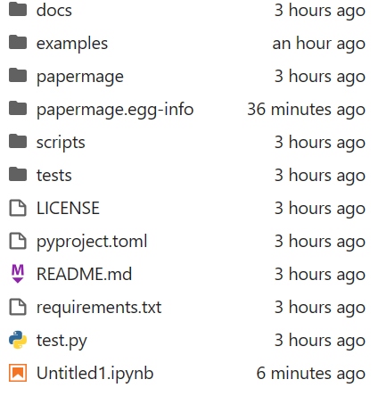

# Pytorch GPU版本配置教程
https://blog.csdn.net/ke996/article/details/112761228  快速设置清华源以及具体的安装步骤

https://pytorch.org/get-started/locally/ Pytorch的版本官网

https://pytorch.org/get-started/previous-versions/ 之前版本的Pytorch

https://zhuanlan.zhihu.com/p/409063952 在Jupyter notebook中添加虚拟环境(存在坑，将某一环境加入jupyter)

https://blog.csdn.net/qq_43276566/article/details/129912986 参考此片如何将单个环境加入jupyter

https://blog.csdn.net/hongguihuang/article/details/108566702 【比较推荐】pip下载ipykernel

https://blog.csdn.net/symun/article/details/112425045 在Jupyter notebook中添加虚拟环境方法2(一次将所有的虚拟环境加入jupter)

# torchtext

torchtext在安装的时候如果和torch的版本不对应，则会出现较大的使用问题

https://pypi.org/project/torchtext/

# Vscode 中 配置anaconda 里面的环境
1、需要将anaconda的三个环境装到系统的环境变量中:
anaconda
anaconda/script/
anaconda/library/bin

2、之后需要将终端修改为prompt，修改之后需要重启终端

3、在重启终端之后，如果需要修改代码的执行环境，需要先conda activate你要执行的环境，再修改代码执行的环境（即右下角的环境）

# Linux下配置Clash
https://www.dianjilingqu.com/635321.html  配置Clash的教程

# Papermage 教程
这里是配置了一下EMNLP的Best Paper：
https://github.com/allenai/papermage/tree/main?tab=readme-ov-file

1、按照上文配置clash
保整你的Clash目录下有：
clash
Country.mmdb
config.yaml
其中cache.db是clash启动以后自动生成的

2、参考papermage的内容，配置环境
```Shell
conda create -n papermage python=3.11
conda activate papermage
pip install -r requirements.txt
pip install --user ipykernel
python -m ipykernel install --user --name=papermage
```
注意这里的第三步我们和原文是不一样的
注意，我们在启动notebook的时候，要去手动选择它的kernel，选为papermage
（有些时候平台机器反应不过来，可能会有点慢）

**尤其注意，我们只能在papermage主目录下，才可以执行它的代码！**


以上，我们的基础环境配置就结束了，下面我们需要挂好梯子


3、梯子的配置
先去到Clash目录下，执行```tmux```，
然后在tmux形成的终端中，执行 ```./clash -d``` . 这样我们就启动了梯子

**然后要新开一个终端**
在这个终端中，我们需要配置基础的端口，执行以下内容：
```Shell
export http_proxy=http://127.0.0.1:7890
export https_proxy=http://127.0.0.1:7890
export all_proxy=socks://127.0.0.1:7891
```


这样我们的梯子配置就完成了，
可以执行以下命令尝试一下：
```
wget https://www.google.com/
```
如果生成了一个index文件，并且在打开tmux中的终端中看到了梯子的使用，则配置成功

之后我们回到papermage的主目录下，便可以执行代码
以下是一个test.py的示例：
```python
from papermage.recipes import CoreRecipe
recipe = CoreRecipe()
doc = recipe.run("tests/fixtures/papermage.pdf")
```
第一次执行是配置数据文件，读取到内容需要进行第二次执行

然后我们也可以在notebook中正常使用这个工具了（可以参考官方的example）
注意，官方的example是无法在它给定的路径下执行的，要回到主目录下


